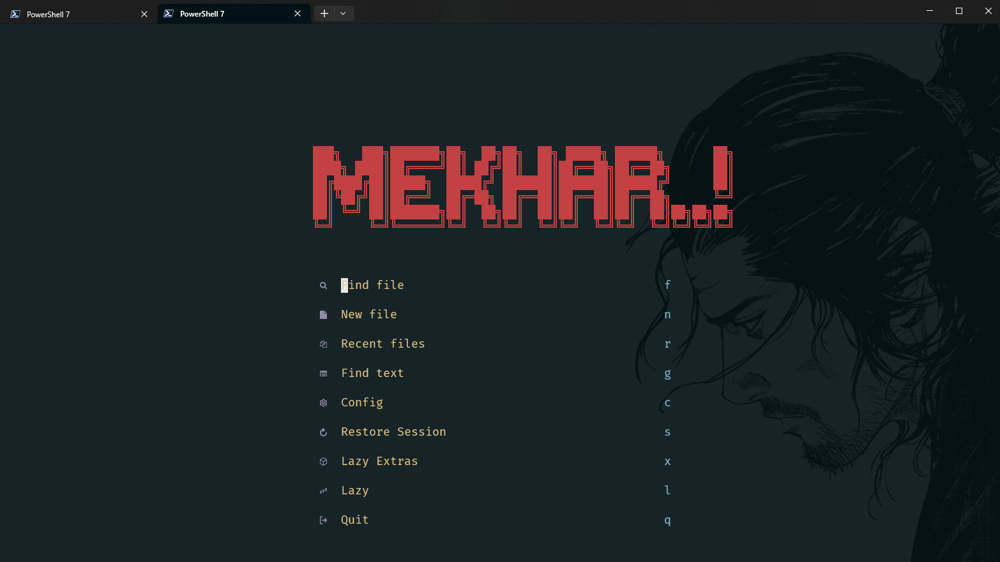
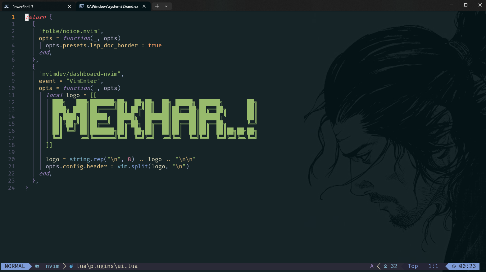
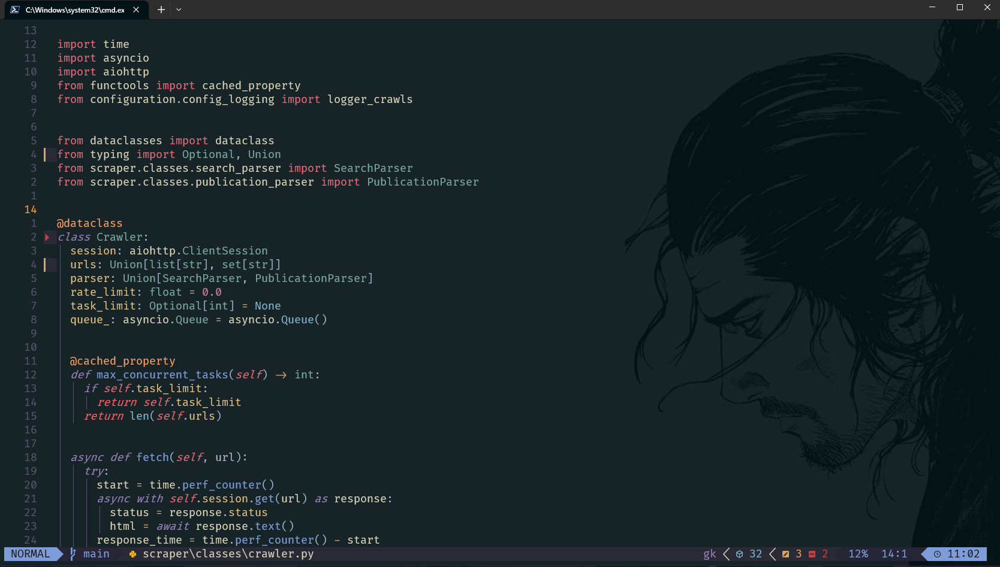
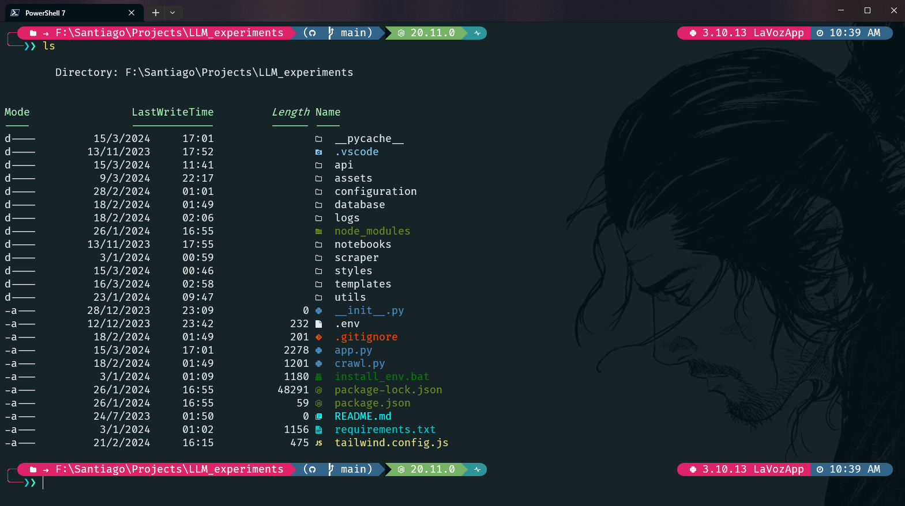

# My dotfiles

## Screenshots

Nvim (LazyVim):




Terminal with terminal icons and firacode Mono:


Dotfiles for:

- **neovim** with [lazyvim](https://www.lazyvim.org/)
- **wsl + fish (with neovim)** with [fish shell](https://fishshell.com/)
- **powershell (and fish)** with [oh-my-posh](https://ohmyposh.dev/)
- **vscode** vim motions and custom keybinds + other settings

Themes im using for neovim, bat, fzf, fish and vscode:

- **nvim:** [Kanagawa](https://github.com/rebelot/kanagawa.nvim)
- **vscode:** [Solarized-Osaka for vscode](https://github.com/sherloach/vscode-theme-solarized-osaka). Original by Devaslife [Solarized-osaka for nvim](https://github.com/craftzdog/solarized-osaka.nvim)

Nerd font im using:

- **Terminal/nvim and vscode**: [Fira Code Mono](https://github.com/tonsky/FiraCode)
- **Installation:** [Oh-my-posh fonts install docs](https://ohmyposh.dev/docs/installation/fonts)


## How to setup WSL with GPU support

This "guide" covers the installation and setup of WSL2 on a Windows machine, enabling GPU support, managing Linux distributions, installing Anaconda, and cloning a GitHub repository using SSH.

### 1. Installing and Enabling WSL2 on Windows

##### Check if You Have WSL2 or WSL1

To determine whether you have WSL1 or WSL2 installed:

```bash
wsl -l -v
```

The output will show the version of each installed distribution.

##### Install WSL2

If WSL is not installed, you can install it using the following command in PowerShell:

```powershell
wsl --install
```

Set WSL2 as the default version:

```powershell
wsl --set-default-version 2
```

### 2. Enable Virtual Machine Platform and Virtualization

##### Enable Virtual Machine Platform

Run the following command in PowerShell as Administrator:

```powershell
dism.exe /online /enable-feature /featurename:VirtualMachinePlatform /all /norestart
```

##### Enable Virtualization in BIOS

1. Restart your computer and enter the BIOS/UEFI settings (usually by pressing `F2`, `F10`, `F12`, or `Delete` during startup).
2. Find and enable the virtualization option (e.g., Intel VT-x, Intel Virtualization Technology, SVM Mode, or AMD-V).
3. Save and exit the BIOS.

### 3. Install a Custom Linux Version via Microsoft Store

##### Install from Microsoft Store

1. Open the Microsoft Store and search for the Linux distribution you want to install.
2. Install your preferred distribution.

##### Check Available Linux Distributions via Terminal

To see a list of all available Linux distributions:

```powershell
wsl --list --online
```

To install any distro, for example Ubuntu 24.04, run:

```powershell
wsl --install -d Ubuntu-24.04
```
To set WSL 2 as the default version:

```powershell
wsl --set-default-version 2
```

##### Update Ubuntu Package List and Packages in WSL

Once you have an instaled distro, to update the package list and upgrade installed packages:

```bash
sudo apt-get update
sudo apt-get upgrade -y
sudo apt-get install -y build-essential
```

To perform a full upgrade:

```bash
sudo apt full-upgrade -y
```

##### Change the Default WSL Distribution

If you have multiple distributions installed, you can set a default one:

```bash
wsl --set-default <DistributionName>
```
### 4. Start the WSL Distribution

You can start the default distribution with:
```powershell
wsl
```

To start a specific distribution:

```powershell
wsl -d <DistributionName>
```

### 5. Installing and Setting up Homebrew

Homebrew is a package manager for Linux, similar to apt/apt-get. We will use it to install oh-my-posh, neovim and all our tools.

##### Step 1: Install Homebrew

Run the following command in your WSL distro terminal to install homebrew:

```bash
/bin/bash -c "$(curl -fsSL https://raw.githubusercontent.com/Homebrew/install/HEAD/install.sh)"
```

##### Step 2: Add Homebrew to Your Path

After installation, you need to add Homebrew to your PATH environment variable. Open your shell configuration file (e.g., ~/.bashrc or ~/.zshrc) and add this line to the end of the file:

```bash
eval "$(/home/linuxbrew/.linuxbrew/bin/brew shellenv)"
```
Then reload the configuration:

```bash
source ~/.bashrc
```
You can verify that homebrew is installed and working by running:

```bash
brew doctor
```
### 6. Terminal: Powershell

> [!TIP]
> If you prefer a more stable and native Linux shell experience in WSL, skip to [Fish](#7-terminal-fish).

I'm using powershell right now with oh-my-posh for windows, if you want to use it on WSL, you can follow the steps below:

To make sure powershell is installed in your Ubuntu distro:

```bash
# First enter WSL
wsl

# Then install PowerShell in Ubuntu
# Add Microsoft package repository
curl https://packages.microsoft.com/keys/microsoft.asc | sudo apt-key add -
sudo sh -c 'echo "deb [arch=amd64] https://packages.microsoft.com/repos/microsoft-debian-bullseye-prod bullseye main" > /etc/apt/sources.list.d/microsoft.list'

# Install PowerShell
sudo apt-get update
sudo apt-get install -y powershell

# Launch PowerShell
pwsh
```
What i do is adding the following to the end ofmy `~/.bashrc` file, to run powershell as default:

```bash
# Open powershell on startup
pwsh
```
##### Useful Powershell tools

##### z directory jumper
Z tracks your most used directories, based on 'frecency'. This is done by storing your CD command history and ranking it over time.

To install:

```powershell
Install-Module -Name z -Force
```
After installing, and after navigating a couple of times to your most frequent directories, you will be able to cd to them just typing `z` + some reference to the directory. Example: 

```powershell
z proj
```
Would be the equivalent of:
```powershell
cd home/your-username/project
```
##### PSReadLine
This module adds autocompletion, commands history, syntax highlighting and other features to powershell. Pretty handy: 

```powershell
Install-Module -Name PSReadLine -AllowPrerelease -Force
```

### 7. Terminal: Fish

Powershell does not behave very well with WSL, you can come into all sort of issues that i'd prefer to avoid (like language servers not working in neovim, etc). So ive included a setup for Fish.

##### Step 1: Install Fish

```bash
brew install fish
```
You need to make fish your default shell, to do this, first check where fish is located:

```bash
which fish
```
##### Step 2: Make Fish your default shell

Add fish to the list of allowed shells:

```bash
echo /path/to/bin/fish | sudo tee -a /etc/shells
```

Then make fish your default shell:

```bash
chsh -s /path/to/bin/fish
```
Restart the terminal and fish should be your default shell.

> [!IMPORTANT]
> If you are having trouble with oh-my-posh or neovim not being recognized by fish, you can add the following to your `~/.config/fish/config.fish` file:

```bash
# Add Homebrew to PATH for Fish
set -Ux fish_user_paths /home/linuxbrew/.linuxbrew/bin /home/linuxbrew/.linuxbrew/sbin $fish_user_paths
```
This should allow Fish to recognize Homebrew-installed binaries like `oh-my-posh` and `nvim`.

### 8. Installing and Configuring Oh-My-Posh (fish)

Oh-My-Posh is a tool that allows you to use themes for your powershell prompt. Comes with icons and different templates to choose from. You can also create or customize your own.

##### Step 1: Install Oh-My-Posh

```bash
brew install jandedobbeleer/oh-my-posh/oh-my-posh
```
##### Step 2: Configure Oh-My-Posh

First install a nerd font using:

```bash
oh-my-posh font install
```
To change your promt, add the following snippet to your `~/.config/fish/config.fish` file: 

```bash
oh-my-posh init fish | source
```
Once added, reload your config for the changes to take effect:

```bash
exec fish
```
If you want to use the theme on this repo, you can add it to your `config.fish` file. First, download the theme file from the repo:

```bash
# Create and navigate to the oh-my-posh folder
mkdir -p ~/.config/oh-my-posh && cd ~/.config/oh-my-posh

# Download the theme file
curl -O https://raw.githubusercontent.com/minollisantiago/dotfiles/master/.config/oh-my-posh/santiago.omp.json
```
Then add the following to your `~/.config/fish/config.fish` file:

```bash
oh-my-posh init fish --config ~/.config/oh-my-posh/santiago.omp.json | source
```
Make sure to reload your config for the changes to take effect:

```bash
exec fish
```

### 9. Additional shell tools

##### fzf Fuzzy finder
From [the github page](https://github.com/junegunn/fzf):
It's an interactive filter program for any kind of list; files, command history, processes, hostnames, bookmarks, git commits, etc. It implements a "fuzzy" matching algorithm, so you can quickly type in patterns with omitted characters and still get the results you want.

Works very similar to Telescope in neovim, but directly from the terminal, you can also inspect files with it and open them with neovim. Ive set some commands with aliases for powershell on the `user_profile.ps1` file on this repo.

To install:

```bash
brew install fzf
```

If you want to have syntax highlighting in the preview, make sure to install `bat`:

```bash
brew install bat
```

This repo comes with the [kanagawa theme](https://github.com/rebelot/kanagawa.nvim) for bat as well as for nvim and fish, if you want to use it for bat, once installed, clone the `kanagawa.tmTheme` file to your `~/.config/bat/themes` folder:

```bash
# Navigate to the bat themes folder
cd ~/.config/bat/themes

# Clone the kanagawa theme
curl -O https://raw.githubusercontent.com/minollisantiago/dotfiles/master/.config/bat/themes/kanagawa.tmTheme
```

If you clone the entire repo into your `~/.config` folder, you'll have the theme by default. 

To make it available to bat, you need to update the binary cache:

```bash
bat cache --build
```

##### zoxide
[Zoxide](https://github.com/ajeetdsouza/zoxide) is a fast cd command that learns your habits.

To install:

```bash
brew install zoxide
```

After installing, you can add the following to your `~/.config/fish/config.fish` file to enable zoxide:

```bash
# Add zoxide to PATH
zoxide init fish | source
```
Very simple to use, you just need to cd to a directory once to let zoxide learn your habits, and then you can use the `z` command to navigate to your most used directories, just type `z` + some reference to the directory you want to navigate to. Example:

```bash
z proj
```
Would be the equivalent of, for example:
```bash
cd ~/projects
```

##### Additional fish utilities/config (including some aliases for fzf)
To add a preview to the fuzzy finder and some other quality of life shortcuts that i like to use, add the following to your `~/.config/fish/config.fish` file:

```bash
# Fuzzy finder with preview: open with cat explorer mode, similar to Telescope
function fuzz-preview
  fzf --preview="bat --color=always {}"
end

function fuzz-preview-nvim
  nvim (fzf -m --preview="bat --color=always {}")
end

# Navigation shortcuts
function ..
  cd ..
end

function ...
  cd ../..
end

function ....
  cd ../../..
end

# Aliases
alias g="git"
alias vim="nvim"
alias cc="clear"
alias ll="ls -lat"
alias ff="fuzz-preview"
alias nff="fuzz-preview-nvim"

# Theme: Kanagawa
set -l foreground DCD7BA normal
set -l selection 2D4F67 brcyan
set -l comment 727169 brblack
set -l red C34043 red
set -l orange FF9E64 brred
set -l yellow C0A36E yellow
set -l green 76946A green
set -l purple 957FB8 magenta
set -l cyan 7AA89F cyan
set -l pink D27E99 brmagenta

# Syntax Highlighting Colors
set -g fish_color_normal $foreground
set -g fish_color_command $cyan
set -g fish_color_keyword $pink
set -g fish_color_quote $yellow
set -g fish_color_redirection $foreground
set -g fish_color_end $orange
set -g fish_color_error $red
set -g fish_color_param $purple
set -g fish_color_comment $comment
set -g fish_color_selection --background=$selection
set -g fish_color_search_match --background=$selection
set -g fish_color_operator $green
set -g fish_color_escape $pink
set -g fish_color_autosuggestion $comment

# Completion Pager Colors
set -g fish_pager_color_progress $comment
set -g fish_pager_color_prefix $cyan
set -g fish_pager_color_completion $foreground
set -g fish_pager_color_description $comment

```
The color theme im using is the [kanagawa theme for neovim](https://github.com/rebelot/kanagawa.nvim), the colors are taken from the fish specific colors file.

##### Clone the `config.fish` file from this repo directly
You can also clone the `config.fish` file from this repo to have the aliases and functions automatically loaded when you open a new terminal:

```bash
# Navigate to the fish folder
cd ~/.config/fish

# Download the config.fish file
curl -O https://raw.githubusercontent.com/minollisantiago/dotfiles/master/.config/fish/config.fish
```
### 10. Installing Neovim

##### Step 1: Install Neovim

```bash
brew install nvim
```
After installing, you can verify that neovim is installed and working by running:

```bash
nvim --version
```
Make sure to have a Nerd Font installed (see the previous step), otherwise you will not be able to use the icons in the plugins that support them.

##### Step 2: LazyVim requirements

**C compiler** 🔥

LazyVim requires a C compiler for [treesitter](https://github.com/nvim-treesitter/nvim-treesitter?tab=readme-ov-file#requirements), treesiter will check whether the following compilers are in %PATH%:

```lua
M.compilers = { vim.fn.getenv('CC'), "cc", "gcc", "clang", "cl", "zig" }
```
Im going with gcc, but i find zig works well too:

```bash
brew install gcc
```
**Telescope** 🔥

You need to install `ripgrep` and `fd` for Telescope to work properly. If `fd` is not installed, you wont be able to live grep, and if `ripgrep` is not installed, you will either not be able to search for files or (in my case) experience weird behaviour where all ignored files are tracked (node_modules, .git files, etc): 

```bash
brew install ripgrep
```
and for fd:

```bash
brew install fd
```

**LazyGit** 🔥

LazyGit is a terminal UI for git, very handy to use instead of the default git commands. You need to install it manually:

```bash
brew install lazygit
```
If you are having issues with lazygit GUI not showing when inside neovim (leader gg), ive found that closing neovim and running `lazygit` in the terminal fixes it the next time you open neovim.

Also, if you are having issues when pushing to SSH remotes using lazygit, you can ensure that Git (and lazygit as well) use the Windows `ssh.exe` executable by running:

```bash
git config --global core.sshCommand "C:\Windows\System32\OpenSSH\ssh.exe"
```

**Clipboard** 🔥

Ive found that WSL does not support clipboard access out of the box, so you wont be able to use the clipboard with neovim unless you install `xclip` or `xsel`:

```bash
sudo apt install xclip
```
**Node/nvm** 🔥

To install all the LSPs for neovim, through `mason`, we need to install `node` (and `npm`) first.

You can install `nvm` first, to manage node versions:

```bash
curl -o- https://raw.githubusercontent.com/nvm-sh/nvm/v0.39.7/install.sh | bash
```

For `nvm` to work with fish, we are using `nvm.fish` instead of the default `nvm.sh`, [here is the repo](https://github.com/jorgebucaran/nvm.fish/tree/main).

> [!NOTE]
> we need to install `fisher` first to use `nvm.fish`:

```bash
brew install fisher
```
Now we can install `nvm.fish`:

```bash
fisher install jorgebucaran/nvm.fish
```

After installing it, we need to add the following to your `~/.config/fish/config.fish`, for some default settings, this is not mandatory:

```bash
# NVM setup (nvm.fish)
set -gx nvm_default_version "lts"
set -gx nvm_mirror "https://nodejs.org/dist"
set -gx nvm_default_packages "npm" "pnpm" "yarn"
```

These will do the following:
- Set the default version to the latest LTS version
- Set the download mirror to the official Node.js mirror
- Install the default packages, whenever you install a new node version: npm, pnpm and yarn *(select more if you want)*

Nvm.fish usefull commands: 

```bash
# List available Node.js versions
nvm list

# Install the latest LTS version
nvm install lts

# Install a specific version
nvm install 22.11.0  # Example version

# Switch to a specific version
nvm use lts

# Set a default version
nvm alias default 22.11.0

# Use the latest LTS version
nvm use lts
```
> [!NOTE]
> homebrew installs the latest node version, use nvm to install a stable version:

```bash
nvm install lts
```

Additionally, after installing node, you need to install the neovim npm package globally for the node provider to work:

```bash
npm install -g neovim
```
Installing it:

- Won't modify your existing Neovim installation
- Won't change any of your configurations
- Only adds support for Node.js-based features in Neovim

The package just provides the necessary bindings for Neovim to interact with Node.js.

**Issues with node and WSL 🔥**

> [!IMPORTANT]
> If you are having issues with `npm` lagging and your shell getting frozen, it may be due to:
>
> - Some conflict with your WSL2 and your windows node installation.
> - Some issue with windows dynamic DNS settings.

To fix it, you can try the following:

**1. Windows DNS**

I found this fix on reddit, [here is the post](https://www.reddit.com/r/bashonubuntuonwindows/comments/nt8asc/npm_install_extremely_slow_on_wsl2/).

The fix involves running this in your terminal: 

```bash
sudo rm /etc/resolv.conf
sudo bash -c 'echo "nameserver 8.8.8.8" > /etc/resolv.conf'
sudo bash -c 'echo "[network]" > /etc/wsl.conf'
sudo bash -c 'echo "generateResolvConf = false" >> /etc/wsl.conf'
sudo chattr +i /etc/resolv.conf
```
Here's a quick explanation of what each command does:
- `sudo rm /etc/resolv.conf`:
Removes the existing DNS resolver config file. This file tells Linux which DNS servers to use to resolve domain names.

- `sudo bash -c 'echo "nameserver 8.8.8.8" > /etc/resolv.conf'`:
Creates a new `resolv.conf` file and sets the DNS server to Google's public DNS server at 8.8.8.8. This is a temporary change.

- `sudo bash -c 'echo "[network]" > /etc/wsl.conf'`:
Creates/overwrites the WSL configuration file, and starts the section for network settings.

- `sudo bash -c 'echo "generateResolvConf = false" >> /etc/wsl.conf'`:
Sets the WSL configuration to not automatically generate a custom `resolv.conf` file. This prevents windows from overwriting the WSL2 network settings.

- `sudo chattr +i /etc/resolv.conf`:
Makes the resolv.conf file immutable, preventing it from being modified by non-root users. This ensures the DNS setting stays fixed.

After running these commands, run with admin privileges:

```bash
wsl --shutdown
```

**2.  Node Path**
First, we need to check if the `node` path in your WSL instance's `PATH` variable is not pointed to your windows node installation:

```bash
echo $PATH
```

You can look for node/nvm in the $PATH using grep, to make sure where its pointed:

```bash
echo $PATH | grep node
```
If it is, add this to your `~/.config/fish/config.fish` file to remove it from the path:

```bash
# Remove Windows Node.js paths from PATH
set -x PATH (string split : "$PATH" | string match -v "*scoop/apps/nvm*" | string join :)

# Ensure nvm.fish is loaded
if not test -d $HOME/.local/share/nvm
    nvm install lts
    nvm use lts
end
```

This will remove the windows node path from the path, and ensure nvm is loaded (with nvm.fish), and initialize the lts node version (in this example, you can pick any specific version if you want).

> [!NOTE]
> The `config.fish` in this repo already has these lines.

After sourcing your `config.fish` file, you can test if it worked by running:

```bash
which node
```

And make sure it points to a WSL path, by default `nvm.fish` should set it inside your `~/.local/share/nvm` folder.

##### Step 3: Install LazyVim

Clone the starter:
```bash
git clone https://github.com/LazyVim/starter ~/.config/nvim
```
Remove the .git folder, so you can add it to your own repo later:

```bash
rm -rf ~/.config/nvim/.git
```
##### Step 4: LazyVim configuration

Clone the repo: 

```bash
git clone https://github.com/minollisantiago/dotfiles.git ~/.config_
```

Copy the nvim folder contents to your ~/.config folder:

```bash
cp -r ~/.config_/.config/nvim/* ~/.config/nvim/
```
Remove the temporary folder:

```bash
rm -rf ~/.config_
```

If you are using the windows terminal, to enable transparent background, ive included the [xiyaowong/transparent.nvim](https://github.com/xiyaowong/transparent.nvim) plugin in the `plugins` folder, to activate it, you need to run (in neovim) the command:

```bash
:TransparentEnable
```
Launch nvim and let LazyVim install the plugins and dependencies.

```bash
nvim
```

### 11. Setup GitHub and Clone a Repository into WSL Using SSH

##### Add your GitHub credentials

```bash
git config --global user.name "your_username"
git config --global user.email "your_email@example.com"
```

##### Set Up SSH Key

First, generate an SSH key, using your user.email (the one you used for git config on the previous step):

```bash
ssh-keygen -t ed25519 -C "your_email@example.com"
```

Or if your system does not support Ed25519:
```bash
ssh-keygen -t rsa -b 4096 -C "your_email@example.com"
```

Press Enter to accept the default file location and name, and then enter a secure passphrase when prompted.

##### Locate Your Keys
After running the command, you should find your SSH keys in the ~/.ssh directory, example with default name:

- Private key: `~/.ssh/id_ed25519`
- Public key: `~/.ssh/id_ed25519.pub`

##### Add SSH keys to your GitHub account
Copy the SSH key to your clipboard:

```bash
cat ~/.ssh/id_ed25519.pub
```
Add your SSH key to your [GitHub account](https://github.com/settings/keys), then test the connection:

```bash
ssh -T git@github.com
```
The first time you run this command, it will prompt you for the passphrase after selecting "yes".

##### Add the SSH Key to the SSH Agent:

You can use the ssh-agent to manage your keys more easily (recommended).

##### For fish

Add the following to your `~/.config/fish/config.fish` file:

```bash
# Start SSH agent and add key
if not ps -ef | grep -v grep | grep ssh-agent > /dev/null
    eval (ssh-agent -c)
    set -Ux SSH_AUTH_SOCK $SSH_AUTH_SOCK
    set -Ux SSH_AGENT_PID $SSH_AGENT_PID
end

if test -f ~/.ssh/id_ed25519
    ssh-add ~/.ssh/id_ed25519 2>/dev/null
else if test -f ~/.ssh/id_rsa
    ssh-add ~/.ssh/id_rsa 2>/dev/null
end
```

This code will:
- Check if ssh-agent is already running
- If not, start it and set the environment variables
- Try to add your ED25519 key first (preferred), falling back to RSA if ED25519 isn't found
- Suppress any error messages if the key is already added

After adding this, restart your terminal or source your config file:

```bash
exec fish
```
> [!NOTE]
> The first time you open a terminal each session, it will prompt you for the passphrase.

##### For bash/zsh
You can also add this to your `~/.bashrc` or `~/.zshrc` file to automatically add the key to the agent. **Note: remember to source your .bashrc/.zshrc file after adding it**.

```bash
eval "$(ssh-agent -s)"
ssh-add ~/.ssh/id_ed25519
```

##### For windows
If you are using powershell, open a new terminal with admin privileges and add the key to the ssh-agent:

```powershell
ssh-add "path\to\the\keys\.ssh\id_rsa"
```
or, if they are located in your home directory:

```powershell
ssh-add $HOME\.ssh\id_rsa
```

You can add the following to your user_profile.ps1 (`$PROFILE`) file to automatically start the ssh-agent and add the key to the agent when you open a new terminal: 

```powershell
# Start ssh-agent if not already running
if ((Get-Service -Name ssh-agent).Status -ne 'Running') {
    Start-Service ssh-agent
}

# Add the key only if it's not already loaded
ssh-add -l | Out-Null
if ($LASTEXITCODE -ne 0) {
    ssh-add $HOME\.ssh\id_rsa  # Adjust path if necessary
}
```

The first time you open a terminal on each session, it will prompt you for the passphrase.

##### Line endings
If you navigate to an existing local project via WSL, you should be able to commit changes directly to the remote repository, since Git tracks the repository settings (like the remote URL) within the .git folder in your project directory

However, if when you run `git status`, Git is interpreting file changes due to different line-ending formats between Windows (CRLF) and WSL/Linux (LF), this can cause files to appear modified even if you haven't actually changed them. You can configure Git to handle line endings consistently across environments:

```bash
git config --global core.autocrlf false
```

##### Clone a Private Repository (example)

```bash
git clone git@github.com:username/private-repo.git
```

Replace `username` and `private-repo` with your GitHub username and the repository name.

##### Check project remote (and change from HTTPS to SSH)

If you cloned the repository using HTTPS, you can change it to SSH:

```bash
git remote -v
git remote set-url origin git@github.com:username/repo-name.git
```

### 12. Access WSL Files from Windows

WSL files can be accessed using a special path. Example of opening a file in Neovim:

```powershell
nvim \\wsl$\Ubuntu-24.04\home\your-username\file.txt
```

Replace `Ubuntu-24.04` and `your-username` with your actual distribution name and username.

### 13. Set Up a Shortcut for Easy Access

##### Access WSL from PowerShell

Add the following alias to your PowerShell profile (`$PROFILE`):

```powershell
Set-Alias wslhome "cd \\wsl$\Ubuntu-24.04\home\your-username"
```

##### Access WSL from Bash

Add this alias to your `~/.bashrc` file in WSL:

```bash
alias wslhome='cd /mnt/c/Users/YourWindowsUsername'
```

### 14. Set Up WSL2 to Support GPU and Verify

If you are working with GPU acceleration, for ML.

##### Install the Latest GPU Drivers

- **For NVIDIA GPUs**: [NVIDIA CUDA on WSL](https://developer.nvidia.com/cuda/wsl)
- **For AMD GPUs**: [AMD Drivers](https://www.amd.com/en/support)
- **For Intel GPUs**: [Intel Graphics Drivers](https://www.intel.com/content/www/us/en/download-center/home.html)

##### Install CUDA Toolkit (for NVIDIA GPUs)

```bash
sudo apt-get update
sudo apt-get -y install cuda
```

##### Verify GPU Support

```bash
nvidia-smi
```

### 15. Python Tools Im using in WSL

##### UV (python package/project manager)

[From their page](https://docs.astral.sh/uv/), uv is an extremely fast python package and project manager, written in Rust.

```bash
brew install uv
```
To enable shell autocompletion for uvx, add this to `config.fish`:

```bash
uvx --generate-shell-completion fish | source
```

Anaconda is alright, but `uv` is faster and lighter, you can use it to replace pip, pip-tools, poetry, etc.

One really cool feature of `uv` is that you can use it to install python versions, and create and switch between environments:

```bash
uv python install
```
For a specific version:

```bash
uv python install 3.12
```
For multiple versions:

```bash
uv python install 3.12 3.11 3.10
```
Once Python is installed, `uv` commands will use it automatically.

To view all python available versions:

```bash
uv python list
```
Another cool feature is that you dont need to explicitly install a python interpreter, `uv` will install the latest version automatically when you run a command that requires it: 

```bash
uv venv
```
In this example, `uv` will install the latest python version and create a virtual environment with it.

For more info on how to set-up a python project with `uv`, go to the [docs](https://docs.astral.sh/uv/guides/install-python/#automatic-python-downloads).

> [!TIP]
> **UV venv activation alias**
>
> I've added a function to activate a uv `venv` without changing directory, for any CLI apps i may have, ive included it in the `config.fish` file on this repo:
>
 > ```bash
> # Function to activate Python uv venv without changing directory
> function activate-venv
>    if test -n "$argv[1]"
>        set -l venv_path "$HOME/projects/$argv[1]/.venv/bin/activate.fish"
>        if test -f $venv_path
>            source $venv_path
>        else
>            echo "Virtual environment not found at: $venv_path"
>            echo "Make sure the project exists and has a virtual environment"
>        end
>    else
>        echo "Please provide a project name"
>    end
> end
> ```
>
> I include all my projects in the `~/projects` folder, so i can activate their virtual environments with the `activate-venv` function and make use of their CLI tools from anywhere.

### 16. Install Anaconda/Miniconda on WSL and Verify

If you need anaconda instead of [UV](#uv-python-package-project-manager) or [poetry](https://python-poetry.org/), perhaps due to issues with CUDA/pytorch, etc. You can install anaconda as an alternative:

##### Download Miniconda/Anaconda

Miniconda:
```bash
wget https://repo.anaconda.com/miniconda/Miniconda3-{version here}-Linux-x86_64.sh -O ~/miniconda.sh
```

Anaconda:
```bash
wget https://repo.anaconda.com/archive/Anaconda3-{version here}-Linux-x86_64.sh -O ~/anaconda.sh
```
Make sure to check for specific versions on the anaconda website.

##### Install miniconda/anaconda:

```bash
bash ~/anaconda.sh
```
Once installed, you need to initialize:

```bash
~/anaconda3/bin/conda init
```
This command modifies your shell startup file (e.g., ~/.bashrc, ~/.zshrc) to include Conda in your PATH. Make sure to restart your terminal or manually source the configuration:

```bash
source ~/.bashrc
```
To verify Conda installation:

```bash
conda --version
```
---

## Dotfiles references

Here is the complete list of references ive used for setting up my dotfiles, all amazing guides and channels, in order of relevance:

##### Nvim, fish shell setup with lazyVim: various configurations, themes, tools, and more, by the great [GentlemanProgramming](https://www.youtube.com/@GentlemanProgramming)

[](https://www.youtube.com/watch?v=-3tLCFgBd0E&t=580s)

##### Nvim setup with lazy: LazyVim config, keymaps, telescope, theme setup and other general configurations, by [Devaslife](https://www.youtube.com/@devaslife)

[](https://www.youtube.com/watch?v=fFHlfbKVi30&t=2238s)

##### Fzf: fuzzy finder for zsh, by [typecraft](https://www.youtube.com/@typecraft_dev)

[](https://www.youtube.com/watch?v=oTNRvnQLLLs)

##### Powershell: oh-my-posh, nvim, nodejs, terminal-icons install and some other initial configurations, by [Devaslife](https://www.youtube.com/@devaslife)

[](https://www.youtube.com/watch?v=5-aK2_WwrmM&t=1771s)

##### Zero to IDE with lazyVim by [Elijah Manor](https://www.youtube.com/@ElijahManor)

[](https://www.youtube.com/watch?v=N93cTbtLCIM&list=PL4UMjyVQYX-Fhbp9kPziRH13caNcO9qMg&index=19)

##### Oh-my-posh for powershell: intro by [HolaMundo](https://www.youtube.com/@HolaMundoDev)

[](https://www.youtube.com/watch?v=6SGIFVJ5Izs)

## Vim motions i use (some)

> [!NOTE]
> Wrote this up when i was practicing the motions to help me remember them. Some of them are vscode only, as i started first learning motions in vscode and later transitioned to neovim.

> [!TIP] 
> **Vertical motions**
>
> - **hjkl: j // k =** to move down/up
> - **{ // } =** go up/down a block of code
> - **ctrl-d // ctrl-u =** go down/up half a page
> - **G // gg =** go to the bottom/to the top of the file
> - **zz =** centers the cursor at the middle of the screen
> - **/{word} =** Search for {word} then press enter and jump through all matches with n (down) or shift-n (up)
> - **?{word} =** Search for {word} backwards, then press enter and invert the search done with /
> - **{\*} while highlighting a word =** "saves" the highlighted word, then press n or shift-n to jump through all matches (up/down)
> - **:{number} =** moves the cursor to line {number}

> [!TIP] 
> **Horizontal motions**
>
> - **hjkl: h // l =** to move left/right
> - **w / b =** moves to the beginning of the next/previous word
> - **e =** moves the cursor to the end of the next word
> - **E =** moves the cursor to the next non-alphanumeric character (commas, parenthesis, etc)
> - **f+{character} =** takes you to that character inside a line (included)
> - **t+{character} =** takes you to that character inside a line (not included)
> - **; // , after f/t+{character} =** jump forward/backwards between the selected {character}
> - **0 =** takes you to the beginning of the line
> - **$ =** takes you to the end of the line

> [!TIP] 
> **Commands/Actions**
>
> - **d =** delete, also copys to clipboard
> - **c =** change, deletes and moves to insert mode
> - **dd =** delete line
> - **cc =** change line, deletes it and moves to inser mode
> - **shift + d =** delete line from cursor
> - **shift + c =** delete line from cursor and enter insert mode
> - **y =** copy to clipboard
> - **yy =** copy (yank) line to clipboard
> - **p =** paste. If we have a complete line on the clipboard, paste line below the cursor
> - **shift-p =** paste. If we have a complete line on the clipboard, paste line above the cursor
> - **u =** undo last
> - **ctrl+r =** redo last
> - **o =** adds a newline below and moves to insert mode
> - **O =** adds a newline above and moves to insert mode
> - **i =** moves into insert mode, back of the cursor
> - **a =** moves into insert mode, front of the cursor
> - **shift + i =** sends you to the beginning of the line and puts you into insert mode
> - **shift + a =** sends you to the end of the line and puts you into insert mode
> - **~ =** changes upper/lower to lower/upper case
> - **. =** redo last command
> - **v =** move to visual mode, can select code with movement
> - **shift + v =** move to visual mode, can select lines with movement
> - **ctrl + v =** block visual mode, to select blocks


> [!TIP] 
> **My navigation commands and keymaps**
>
> Commands can be combined with motion to have enhanced effects:
>
> - **leader+q =** Close editor/file
> - **leader+w =** Save file
> - **leader+x =** Save file and close it
> - **leader+v =** Split screen vertically
> - **leader+h =** Split screen horizontally
> - **leader+c =** on visual mode, comment line
> - **tab // shift-tab =** Tab navigation
> - **ctrl-d // ctrl+u =** combined with zz to move down/up and center view
> - **ctrl+shift+n =** While on the editor, open new vscode project
> - **tab // shift-tab [insert or visual mode] =** indent line, if you combine with movement you can indent blocks


> [!TIP] 
> **File tree**
>
> - **ctrl-e =** open/close file tree
> - **jk =** Move down/up inside the file tree
> - **h =** Close folder (if opened)
> - **l =** Open file or folder
> - **n =** Create new file inside current location on the tree
> - **ctrl-n =** Create and open new file
> - **ctrl+shift+n =** Create new folder inside current location on the tree

> [!TIP] 
> **Console**
>
> - **ctrl+j =** Open/close console
> - **ctrl+shift+j =** Open new console
> - **ctrl+shift+q =** Terminate console
> - **ctrl+shift+(a/b) =** Move up/down between running consoles

> [!TIP] 
> **Harpoon**
>
> - **leader+a =** add file to the harpoon editor list
> - **leader+e =** open harpoon editor filelist, editable
> - **leader+i (number) =** open the ith editor previously stored

> [!TIP] 
> **Some tricks (motions)**
> - **d-i-W =** delete all words until hitting whitespace on both sides (right and left), applies for all commands (c, v, d).
> - **d-i-q =** delete all contents inside quotes, applies for all commands (c, v, d).
> - **dii =** delete all contents at identation level, applies for all commands (c, v, d).
> - **ctrl-d and ctrl-u =** changed settings to add zz to each command, this centers the cursor and so the code "travels" up and down with the cursor always fixed at the center of the screen. **Best way to move vertically**
> - **trick:** select a number of lines with visual mode, then press shift-i to trigger insert mode on all of them
> - **%:** standing on a character, sends the cursor to the same type of character, works well with visualmode to select code between {[]}

> [!TIP] 
> **Some combos**
>
> - **d + t + {character} =** delete line up to {character}
> - **c + t + {character} =** delete up to {character} and go into insert mode
> - **press \* to select all matching words then type: :%s//new_word+enter =** replace all occurrences with new_word
> - **shift + V [Visual mode line] + select lines + tab/shift+tab =** indents a block of code
> - **ctrl + shift + v =** open markdown server

## Resources (motions)

##### Vim motions intro by The Primeagen

[](https://www.youtube.com/watch?v=X6AR2RMB5tE&list=PL4UMjyVQYX-Fhbp9kPziRH13caNcO9qMg&index=3&pp=gAQBiAQB)

##### Vim motions - horizontal by the Primeagen

[](https://www.youtube.com/watch?v=5JGVtttuDQA&list=PL4UMjyVQYX-Fhbp9kPziRH13caNcO9qMg&index=4&t=349s)

##### Vim motions - vertical by the Primeagen

[](https://www.youtube.com/watch?v=KfENDDEpCsI&list=PL4UMjyVQYX-Fhbp9kPziRH13caNcO9qMg&index=5)

##### Vim motions for vscode by MelkeyDev, [settings.json and keybinds.json files for vscode](https://github.com/Melkeydev/vscode_bindings)

[](https://www.youtube.com/watch?v=GST8we5uABo)

##### Vim Tutorial by Ben Awad

[](https://www.youtube.com/watch?v=IiwGbcd8S7I&list=PL4UMjyVQYX-EsTmFDgKK_3yld_xiFcRXO&index=31&t=2315s)
